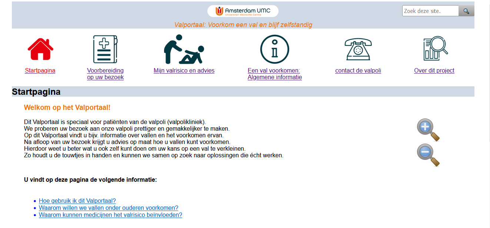
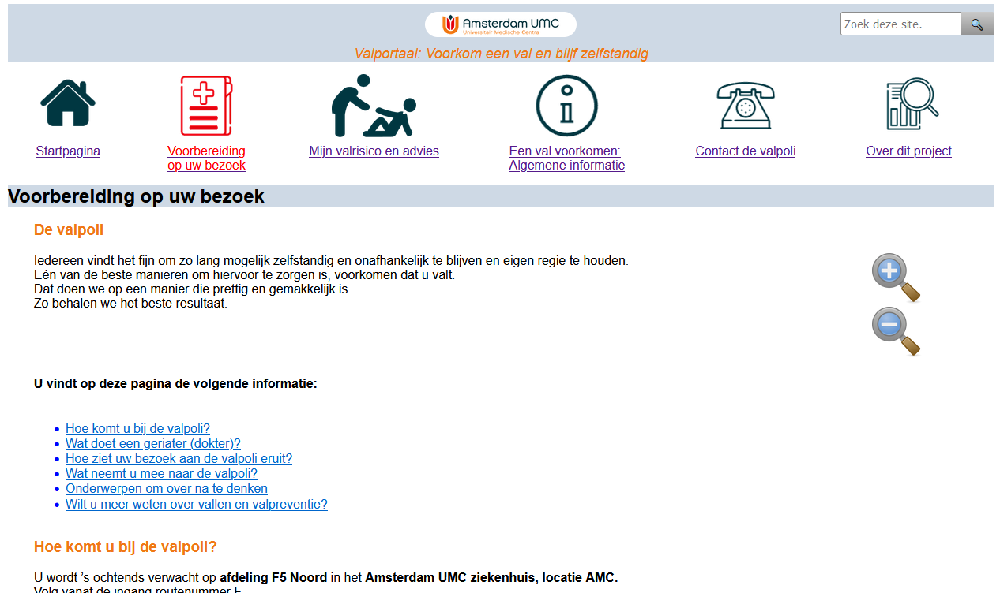
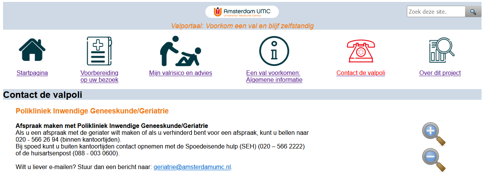
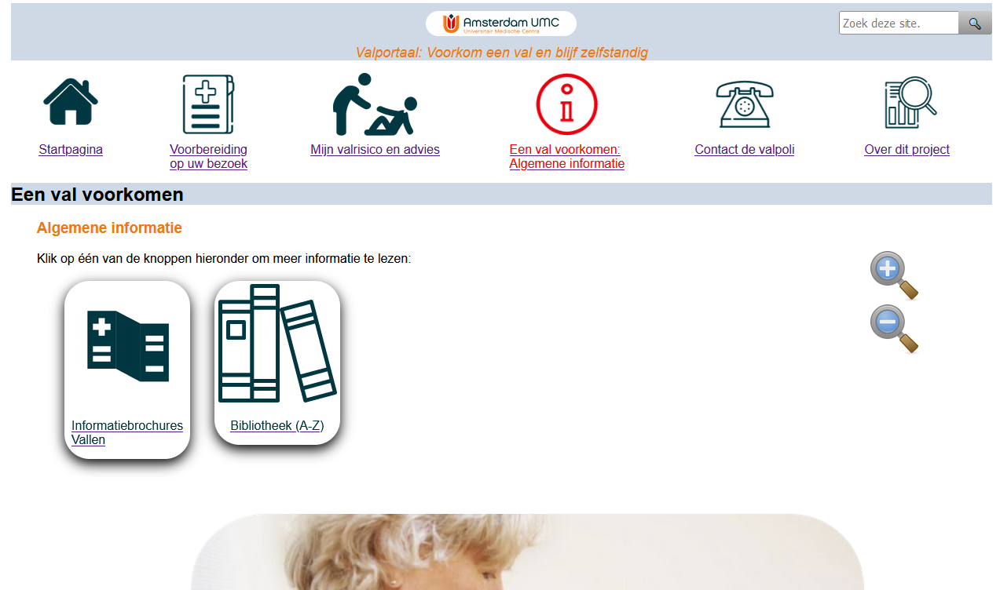
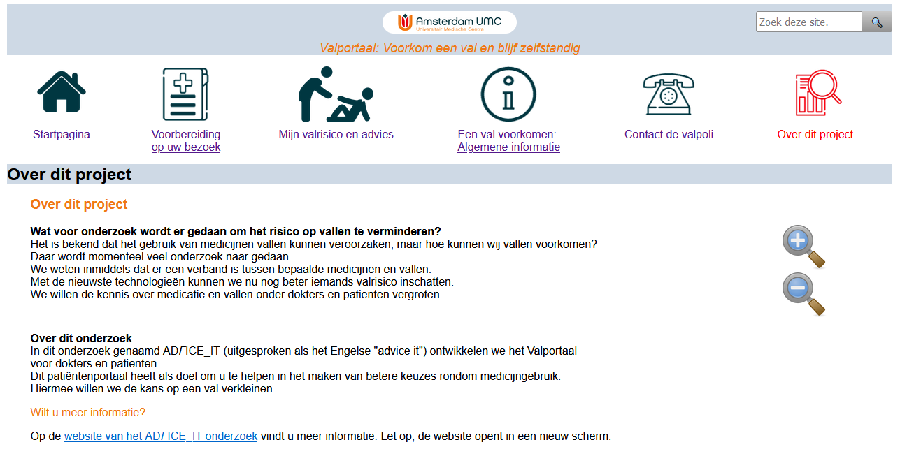
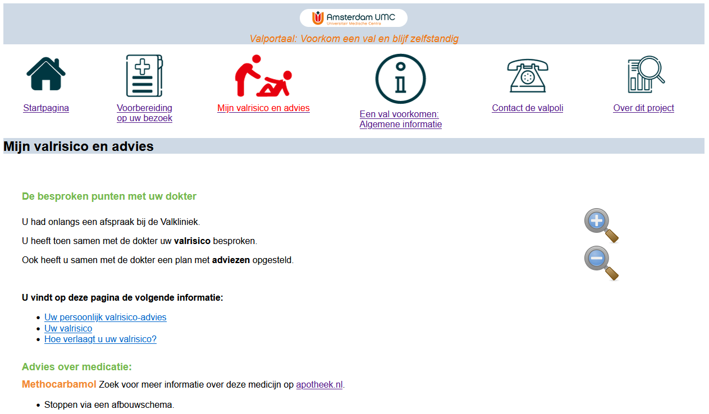

# valportaal

The purpose of the Valportaal is to empower patients to act to reduce their own fall risk, and to actively participate in decisions about their fall-related care.

The Valportaal is designed to be simple and easy-to-navigate, but also provide the information a patient needs to educate themselves about falls and prepare for their visit to the geriatrics department or fall clinic. 

The patient will be invited to visit the Valportaal when they are invited to join the study. The Start Page gives  general information about the site and about reducing fall risk.

## Preparation and Contact
Two pages will be customized for each hospital participating in the ADFICE_IT trial: the Preparation page and the Contact page. The Preparation page tells patients what to expect at their fall clinic visit. Both pages give information on location and route. The Contact page also gives additional contact info.

## Brochures and Library
The patient can also read more information about preventing falls the Brochures and Library. The library contains links to more resources.

## About the study
The patient can also read about our study.

## Peraonalized advice
Finally: After the doctor has released the advice they selected in the ADFICE_IT CDSS, the patient can log in to the Valportaal and view the advice they discussed with their doctor. This same information can be printed from the CDSS for patients that do not use the internet.
